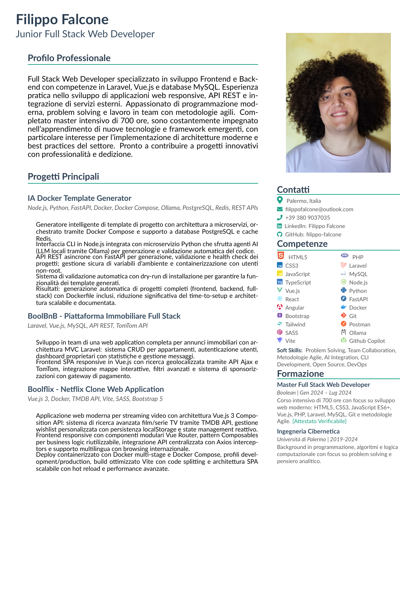

# Filippo Falcone - Curriculum Vitae

<!-- Anteprima CV come immagine (aggiornata automaticamente) -->

**↑ Clicca sull'anteprima per aprire il CV completo con link interattivi ↑**

---

**📄 CV automaticamente aggiornato ad ogni commit**

 

📋 [Istruzioni di build e setup](INSTRUCTIONS.md) | 🔧 [Tecnologie utilizzate](INSTRUCTIONS.md#-sistema-colori-avanzato)

---

_Junior Full Stack Web Developer specializzato in Laravel, Vue.js e tecnologie moderne_

